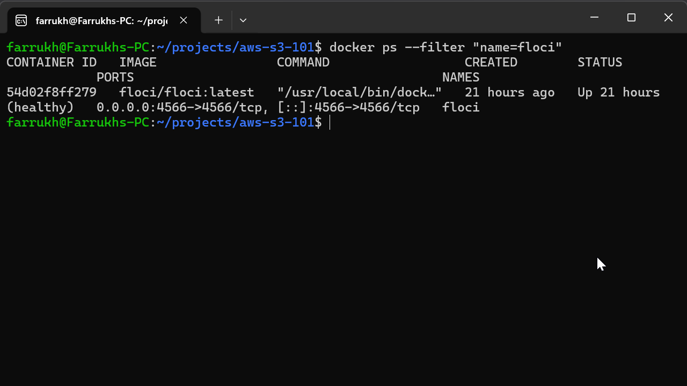
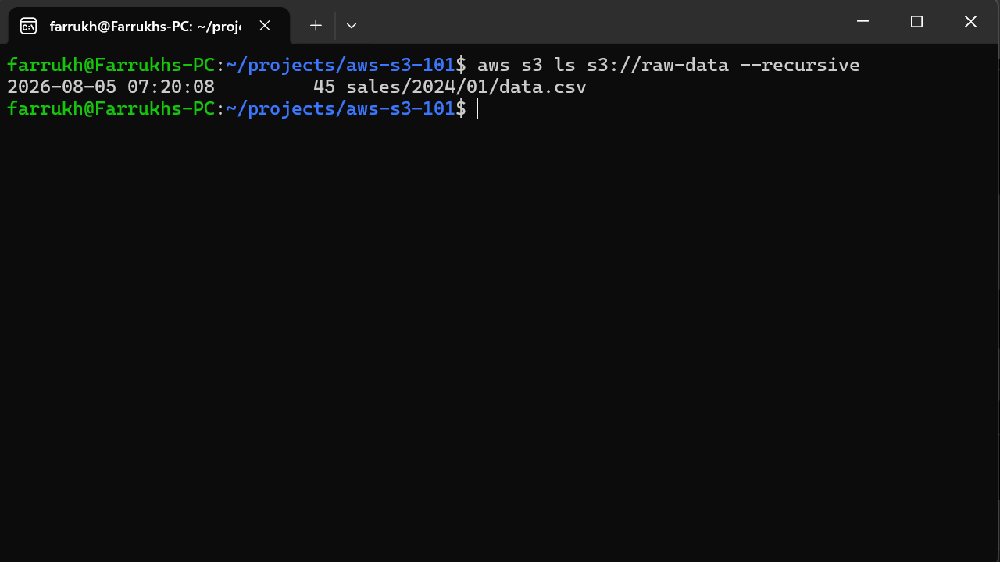
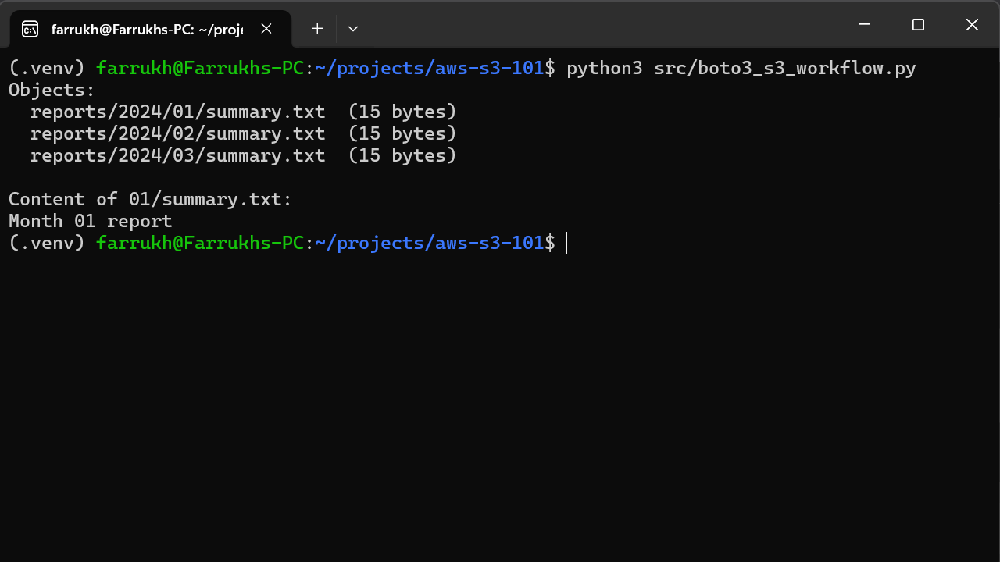
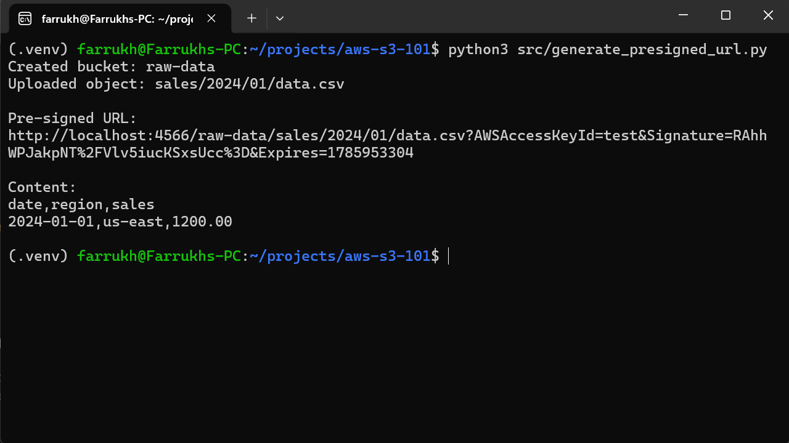
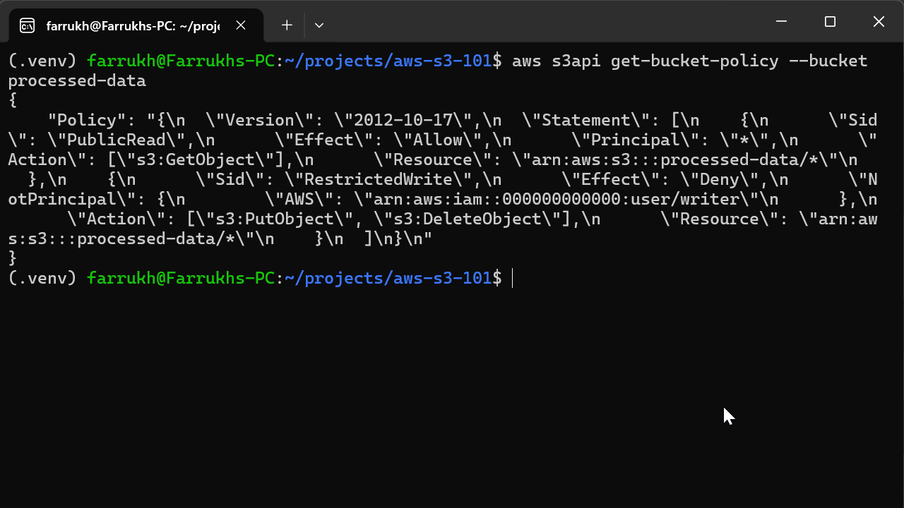

# AWS S3 Practice Project

## Overview

This project explores Amazon S3 through hands-on implementation using Python, boto3, the AWS CLI, and Docker.

The goal is to understand core object storage concepts while building practical examples that demonstrate common S3 workflows and cloud development practices.

## Features

* Create S3 buckets using boto3
* Upload objects using boto3
* Upload, download, list, sync, and delete objects with the AWS CLI
* Generate pre-signed URLs for temporary object access
* Configure and apply S3 bucket policies
* Document S3 concepts and workflows

## Technologies Used

* Python
* boto3
* AWS CLI
* Docker
* Docker Compose

## Project Structure

```text
aws-s3-101/
|
├── docs/
|   ├── boto3-s3-workflow.md
│   ├── boto3-create-bucket.md
│   ├── boto3-upload-object.md
│   ├── bucket-policy.md
│   ├── presigned-url.md
│   └── s3-cli-operations.md
|
├── policies/
│   └── bucket-policy.json
├── src/
|   ├── boto3_s3_workflow.py
│   ├── create_bucket.py
│   ├── generate_presigned_url.py
│   └── upload_file.py
|
├── docker/
├── docker-compose.yml
├── requirements.txt
├── .env.example
├── .gitignore
└── README.md
```

## Skills Demonstrated

* Amazon S3 bucket management
* Object storage concepts
* Object uploads and downloads
* boto3 S3 workflows
* Prefix-based object organization and filtering
* Prefix-based object organization
* AWS CLI operations
* boto3 SDK development
* Pre-signed URL generation
* Bucket policy configuration
* Docker-based development workflow

## Documentation

Project documentation is available in the `docs/` directory and includes:

* Creating S3 buckets with boto3
* Uploading objects with boto3
* Complete S3 workflows using boto3
* S3 CLI operations
* Pre-signed URLs
* Bucket policies

## Screenshots

### Docker Container Running



### AWS CLI Operations



### boto3 S3 Workflow



### Pre-Signed URL Generation



### Bucket Policy Verification



## Project Status

## Project Status

✅ Complete

This project demonstrates core Amazon S3 operations using Python, boto3, the AWS CLI, and a local AWS environment powered by Floci. It includes bucket creation, object uploads and downloads, prefix-based object organization, pre-signed URLs, bucket policies, and complete S3 workflows.
